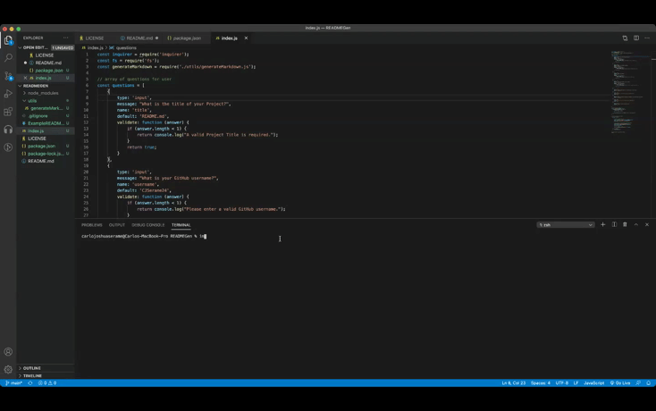

# README.md Generator
 
## Description
Who likes writing out and formatting README's? I don't! This is a quick and easy tool for user to generate a README file.

## Installation
To create your own README file: run `npm install inquirer` to install [inquirer](https://www.npmjs.com/package/inquirer) which will prompt you for inputs from the command line.

Application can be ran by typing node index.js in the terminal.

# Usage

Run the application in the terminal using `node index.js`.

You will be prompted to answer questions that make up the diffent sections of the to be generated README file.

After all the questions have been answered your README document will be generated.

## License

MIT License

Copyright (c) 2021 Carlo Joshua Serame

Permission is hereby granted, free of charge, to any person obtaining a copy
of this software and associated documentation files (the "Software"), to deal
in the Software without restriction, including without limitation the rights
to use, copy, modify, merge, publish, distribute, sublicense, and/or sell
copies of the Software, and to permit persons to whom the Software is
furnished to do so, subject to the following conditions:

The above copyright notice and this permission notice shall be included in all
copies or substantial portions of the Software.

THE SOFTWARE IS PROVIDED "AS IS", WITHOUT WARRANTY OF ANY KIND, EXPRESS OR
IMPLIED, INCLUDING BUT NOT LIMITED TO THE WARRANTIES OF MERCHANTABILITY,
FITNESS FOR A PARTICULAR PURPOSE AND NONINFRINGEMENT. IN NO EVENT SHALL THE
AUTHORS OR COPYRIGHT HOLDERS BE LIABLE FOR ANY CLAIM, DAMAGES OR OTHER
LIABILITY, WHETHER IN AN ACTION OF CONTRACT, TORT OR OTHERWISE, ARISING FROM,
OUT OF OR IN CONNECTION WITH THE SOFTWARE OR THE USE OR OTHER DEALINGS IN THE
SOFTWARE.

## Contact
Questions? please contact me!
Github: [CJSerame24](https://github.com/CJSerame24)
Email: [carloserame24@gmail.com](carloserame24@gmail.com)
